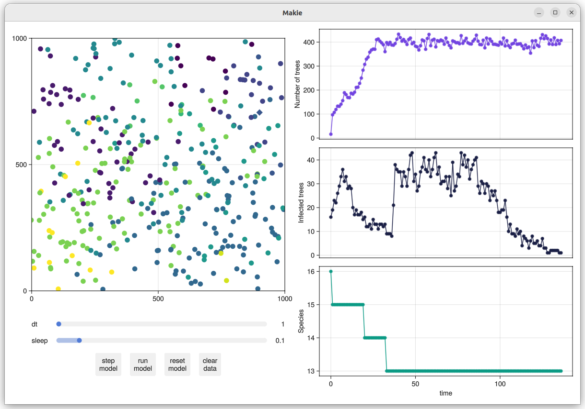

# IBM project

*yDiv Julia course 2024*

## Background

The question of why there are so many tree species in tropical forests has intrigued ecologists
for over a century. In 1970 and 1971, Daniel Janzen and Joseph Connell proposed one possible 
mechanism: density-dependent seed mortality. They argued that seeds and saplings are more likely 
to die when they are close to the parent plant, for example through the action of species-specific
pathogens. This means that trees of other species are more likely to survive in the vicinity of a
mother tree than its own offspring, thus circumventing competitive exclusion.

In this project, you will build an individual-based model to explore this hypothesis.

*Note: this was originally a project I carried out for a course in ecological modelling,
taught by Thomas Hovestadt at the University of Würzburg in 2020. My original files can be
found at [https://github.com/veddox/jcm](https://github.com/veddox/jcm).*

## Instructions

### Preparing

0. Download the contents of this folder (`Projects/IBM`). If you previously cloned the
   course repository from Github, you already have all the files you need.

1. Read the associated project report (`janzen-connell.pdf`) to understand the ecological
   background of this project, and the structure and functioning of the IBM.

2. Familiarise yourself with the Agents.jl 
   [tutorial](https://juliadynamics.github.io/Agents.jl/stable/tutorial/).

3. Suggestion: work in groups of 2-3 - find your partner(s).

### Modelling

If you want to take a look at the code that generated the figures in the report, you will
find it in the [`jcm` repo](https://github.com/veddox/jcm). This was originally written in
plain Julia and includes more features than we are interested in right now.

For this course, I created a new implementation of the original model that uses the Agents.jl
framework. While it doesn't yet include all the analyses I did for the first project, it
does offer an interactive user interface using [Makie](https://docs.makie.org/stable/). You
will find the code for this model in the `solution` folder. (Don't look there just yet!)

Because implementing the project from scratch would likely take more time than we have, 
I have prepared two "fill-in-the-gaps" versions of the code in the folders `easy` and `hard`.
Depending on your level of confidence / willingness to learn, select one of these and copy
it to your own hard drive.

Open the two files `jcm.jl` and `ecology.jl` in VS Code (or another editor of your choice)
and acquaint yourself with their structure. I have left `TODO` comments describing what
still needs to be done to make the model work. The 
[Agents.jl API](https://juliadynamics.github.io/Agents.jl/stable/api/) is a useful reference
to keep open. If you have further questions, don't hesitate to ask!

**Happy hacking!** :computer: :grinning:

---

&copy; Daniel Vedder, 2024
