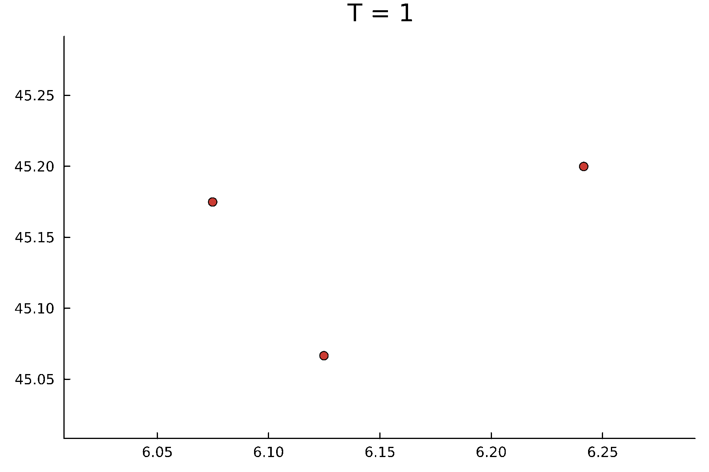
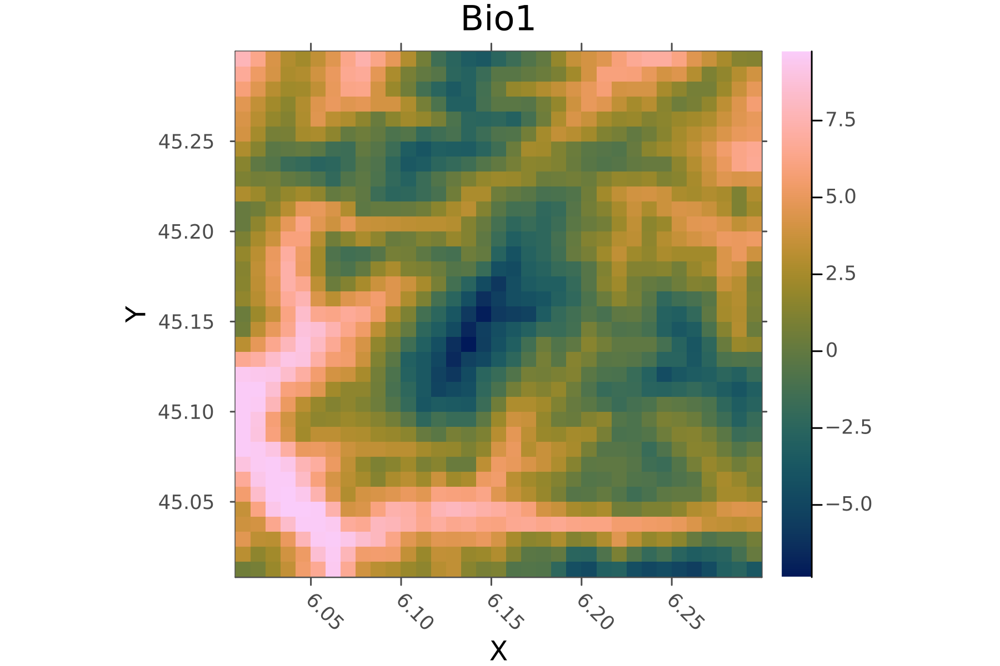

# Ecologically-informed neural networks


Invasive species pose major threats on nature, nature’s contributions to people, and good quality of life ([IPBES, 2019](https://zenodo.org/records/3553579)), with global annual costs estimated to exceed 423 billion USD. 
The management of invasive alien species requires the modelling of the species range and spread dynamics, in order to optimally allocate control effort.
While current state-of-the-art modelling approaches such as deep learning species distribution model (deep SDM) can help in determining the potential niche of invasive alien species (e.g., [Brun et al. 2024](https://www.nature.com/articles/s41467-024-48559-9)), they assume that species are always in equilibrium with their environment, neglecting key transient ecological processes such as demographic changes and dispersal. This oversight is problematic, because these processes are crucial in determining the establishment of a species in a novel environment.

The proposed project aims to fill this gap by developing an ecologically-informed neural network, following a physics-informed neural network approach (see e.g.[Raissi et al. 2019](https://www.nature.com/articles/s41467-024-48559-9)). 


Specifically, we will build a process-based dynamical model, that we will couple to a deep SDM. The resulting approach will allow to inform the process-based model with presence-absence data, generating a data-driven dynamical forecast of species invasion. 

Julia is great for physics-informed approaches, because it allows to quickly build fast process-based models. Because Julia is an AD-pervasive language, these process-based models can be further differentiated, so that you could eventually calibrate its parameters against the ecological data at hand. 


## What you will learn
- Building a simple deep SDM
- Building a simple process-based model
- Scientific machine learning

## Prerequisite
- [To understand what is a physics-informed neural network and how to code it in Julia, read through this tutorial](https://book.sciml.ai/notes/03-Introduction_to_Scientific_Machine_Learning_through_Physics-Informed_Neural_Networks/)

## Data
You'll work with a mock-up presence-absence (PA) dataset of a virtual invasive species. But feel free to work with real data if you have an idea! This PA dataset is derived from a true abundance dataset, generated by a process-based model.

### Presence absence data

in `data/PA_data.csv`

Notice how the number of samples increases over time. You should correct for this bias!

### True population abundance data

in `data/true_abundance_data.jld2`

You may use this dataset to evaluate your model, but not for training!


### Environmental raster data

in `data/bio1.tif`

## Work packages

The different work packages below can be addressed independently and distributed among different teams. The team could collaborate on a public repository.

#### **WP A**: Process-based model
The goal is to construct a model which simulates the variation in abundance of a species on a lattice. Given a lattice (or graph) $G$ which consists of $N$ vertices $\{v_1, \dots, v_N \}$, we want to predict the vector of abundance ${\bf n}_{t+1} = (n_{1, t+1}, \dots, n_{N, t+1})$ based on a vector ${\bf n}_t$.

<!-- ##### Model -->
```julia
struct DynSDM{L,SD,ED} <: AbstractDynModel
    landscape::L
    spatial_dynamics::SD
    ecological_dynamics::ED 
end
```
This structure contains the model dynamics, which can be simulated with the following function


```julia
simulate(model::AbstractDynModel, u0, ntsteps)
```
Given a `model` and an initial abundance vector `u0` and the number of time steps `ntsteps`, this function returns a vector of size `ntsteps` containing abundance vectors with the same shape as `u0`  for each of the time steps investigated.

You could consider any sort of model, but here are some examples
- The discrete reaction diffusion model from [Bonneau et al. 2017](https://esajournals.onlinelibrary.wiley.com/doi/10.1002/ecs2.1979), where individuals experience a logistic growth with a locally defined carrying capacity $K_i$ that depends on the landscape characteristics, and where some individuals disperse to neighboring vertices.
- The metapopulation model from [Hanski et al. 2003](https://www.nature.com/articles/35008063) 


#### **WP B**: Constructing a deep SDM in Julia
The goal is to construct a deep SDM which can predict the species distribution at time $t$, given an array of absence-presence observations. 

You are given an array `XY_arr` where `XY_arr[i] = (pred, target)`, where `pred[:,i]` is an array of predictors to predict `target[i]`, which is `1` if the species has been detected and `0` if not. Specifically, `pred[:,i] = (x, y, temp)`.

Build a model (with Flux.jl) that predicts the full species distribution for each time steps.

To do so, build a function 
```julia
train(;nns, 
        PA_data, 
        optim, 
        n_epochs,)
```
where `nns` is an array of neural network, with `nns[i](pred)` predicting the distribution of the species at time $t_i$.

##### **Sub-objective**: Hyperparameter optimisation

Hyperparameters of a neural network model are parameters that are not learned during training but are set by the user before training. The hyperparameters define the structure and behavior of the neural network and influence how the model learns from the input data. 
Some resources:
- [Hyperopt.jl](https://github.com/baggepinnen/Hyperopt.jl).

- [A Conceptual Explanation of Bayesian Hyperparameter Optimization for Machine Learning](https://towardsdatascience.com/a-conceptual-explanation-of-bayesian-model-based-hyperparameter-optimization-for-machine-learning-b8172278050f)


#### **WP C**: Ecologically-informed neural network
The objective is to constrain the deep SDM developed in **B** with the process-based model developed in **A**.

Specifically, you should additionaly constrain the deep SDM so that its predictions are coherent with the process-based model. That is, we eventually want that

`simulate(model, nns[i-1](pred), 1) ≈ nns[i](pred)`

while `nns` still predict the PA data. To do so, build a function 
```julia
train(;nns, 
        dyn_model, 
        PA_data, 
        optim, 
        n_epochs,)
```

to perform training.


Once this is done, check how good are your predictions outside the training range by predicting with

```julia
simulate(model, f[end](pred), 1)
```

which will predict ${\bf n}_{T+1}$.


